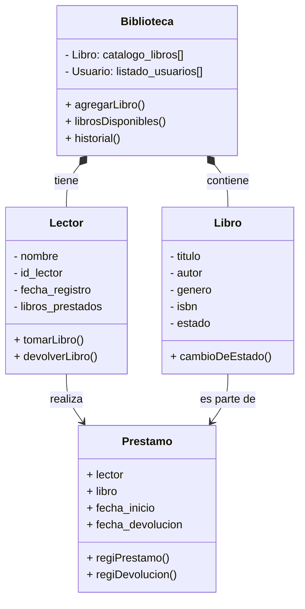

## CASO BIBLIOTECA 

### Hecho por: Yura Hernandez y Juan José Bolivar

```mermaid

classDiagram
    class Biblioteca {
        - Libro: catalogo_libros[]
        - Usuario: listado_usuarios[]
        + agregarLibro()
        + librosDisponibles()
        + historial()
    }

    class Libro {
        - titulo
        - autor
        - genero
        - isbn
        - estado
        + cambioDeEstado()
    }

    class Lector {
        - nombre
        - id_lector
        - fecha_registro
        - libros_prestados
        + tomarLibro()
        + devolverLibro()
    }

    class Prestamo {
        + lector
        + libro
        + fecha_inicio
        + fecha_devolucion
        + regiPrestamo()
        + regiDevolucion()
    }

    Biblioteca *-- Libro : contiene
    Biblioteca  *--  Lector : tiene
    Lector  -->  Prestamo : realiza
    Libro  -->  Prestamo : es parte de

```